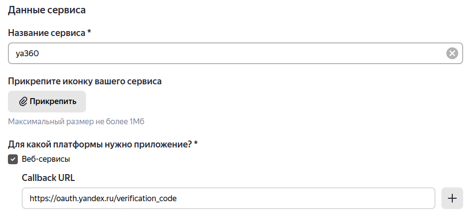

.. _id1:

Установка
---------

Для производственного использования рекомендуется использовать стабильную версию релиза из репозитория pypi.

Установка из pypi производится следующей командой:

.. code-block:: console

    $ pip install ya360

.. tip::
    Для обслуживания нескольких организаций, рекомендуется использовать механизм venv:

    .. code-block:: console

        $ python3 -m venv org1
        $ source org1/bin/activate
        $ (org1) pip install ya360
        $ (org1) deactivate
        $ python3 -m venv org2
        $ source org2/bin/activate
        $ (org2) pip install ya360
        $ (org2) deactivate

Конфигурирование
----------------

После успешной установки, утилиту необходимо настроить на работу с вашей организацией.
При первом запуске и до момента пока не будет сформирован конфигурационный файл,
приложение будет запускать мастер первоначальной настройки.

.. code-block:: console

    $ ya360

    ПЕРВОНАЧАЛЬНАЯ КОНФИГУРАЦИЯ ПРИЛОЖЕНИЯ

    1. Авторизуйтесь на Яндексе. Укажите логин и пароль администратора организации,
    от имени которого будут выполняться запросы к API

        https://passport.yandex.ru/

    2. Зарегистрируйте приложение

        https://oauth.yandex.ru/client/new

    Заполните поля:
        Название сервиса: ya360
        Для какой платформы нужно приложение: Веб-сервисы
        Callback URI: https://oauth.yandex.ru/verification_code
        Какие данные вам нужны: Яндекс 360 Admin API, Яндекс 360 Directory API
        (отметить все галочки)

    3. Перейдите на страницу созданных приложений и выберете ya360

        https://oauth.yandex.ru/

Интерактивный мастер первоначальной настройки для начала предложит выполнить 3 простых шага:

Шаг 1: Авторизация на Яндекс
++++++++++++++++++++++++++++

Для успешной регистрации утилиты, на первом шаге необходимо авторизоваться в системе Яндекс по адресу: `https://passport.yandex.ru <https://passport.yandex.ru>`_ под учетной записью с правами администратора организации.

Права администратора необходимы для выполнения запросов, связанных с созданием, изменением и удалением данных в организации.

Шаг 2: Регистрация приложения (утилиты)
+++++++++++++++++++++++++++++++++++++++

Далее проходим по ссылке `https://oauth.yandex.ru/client/new <https://oauth.yandex.ru/client/new>`_ и заполняем поля как показано на :ref:`fig01` и :ref:`fig02`

.. _fig01:

    *Рис. 1*

    +-------------------------------------+-------------------------------------------+
    |Название сервиса:                    | ya360                                     |
    +-------------------------------------+-------------------------------------------+
    |Для какой платформы нужно приложение:| Веб-сервисы                               |
    +-------------------------------------+-------------------------------------------+
    |Callback URI:                        | https://oauth.yandex.ru/verification_code |
    +-------------------------------------+-------------------------------------------+

.. _fig02:

    *Рис. 2*

Нажимаем на кнопку :guilabel:`Создать приложение` и переходим на следующий шаг.

Шаг 3: Получаем необходимые ключи
+++++++++++++++++++++++++++++++++

После успешного создания и регистрации приложения, нам остается получить ``ClientID`` и ``Client secret``. Переходим на `https://oauth.yandex.ru/ <https://oauth.yandex.ru/>`_, выбираем созданное приложение, получаем необходимые нам поля

.. _fig03:

    *Рис. 3*
    
и возвращаемся в консоль:

.. code-block:: console

    Введите ClientID: *********
    Введите Client secret: ***********
    Введите e-mail администратора организации, от имени которого
    будут выполняться запросы к API: *****@yandex.ru

Шаг 4: Подтверждаем получение токенов
+++++++++++++++++++++++++++++++++++++

.. code-block:: console
    
    4. Перейдите по следующей ссылке и получите код подтверждения

      https://oauth.yandex.ru/authorize?response_type=code&client_id=*****&login_hint=*****@yandex.ru&force_confirm=yes

    Введите код подтверждения: *******
    
    5. Зайдите в профиль организации

      https://admin.yandex.ru/company-profile

    Введите ID организации: 777

На заключительном шаге, нам необходимо пройти подтверждение получения токенов для запущенной копии утилиты и внесения ID организации. Токены необходимы для удостоверения запросов вашей копиии приложения и имеют время жизни (примерно 1 год).

.. note::
    Начиная с версии ``2.5.0`` приложение самостоятельно перезапрашивает токен с заканчивающимся сроком действия

На этом конфигурирование окончено и можно полноценно пользоваться приложением. Если вам необходимо управлять несколькими организациями, то стоит еще раз вернуться в главу :ref:`id1`

Переконфигурирование
--------------------

Если же будет необходимость изменить данные или вручную запустить мастер, это можно выполнить командой

.. code-block:: console

    $ ya360 make-config